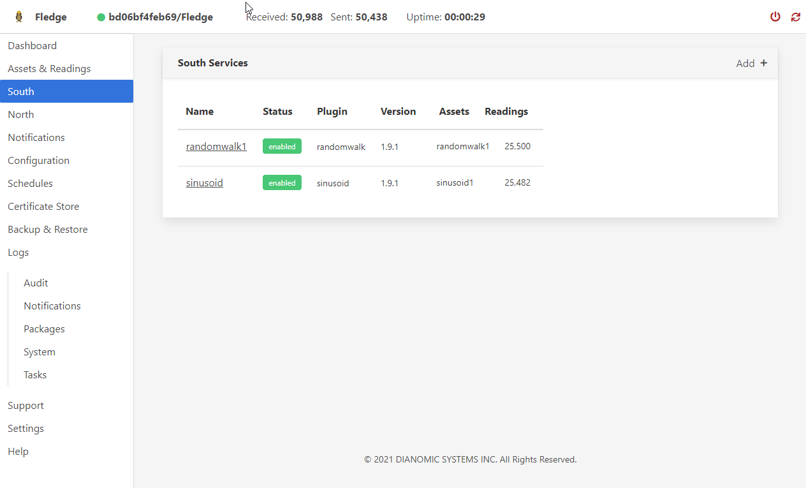

# FLEDGE GUI Docker Image
The FLEDGE GUI allows you to configure a FLEDGE IIoT node. South plugins connect to devices to collect data. North plugins forward that data to a destination. You can also configure filters to modify the data string. Notifications plugins detect conditions in the data stream and perform a configurable action.

## Build the Docker Image
docker build --rm -t fledge-gui .

## Run detached with autorestart
docker run -d -p 80:80 --name fledge-gui

## View logs
docker logs -f fledge-gui

## To view the GUI in your  web browser go to 
http://localhost

